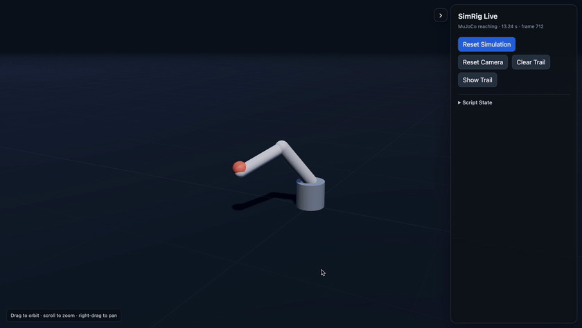

# SimRig

<div align="center">


<br>

<em>A pretrained Unitree G1 policy preview with a scripted greeting.</em>

</div>

Build, train, evaluate, and visually inspect MuJoCo control experiments with
agent-guided task design, PPO training, and interactive browser previews.

SimRig combines:

- a Python CLI that inspects models, runs MuJoCo Playground environments,
  trains Brax PPO policies, evaluates checkpoints, and serves previews;
- an agent skill that teaches Codex, Claude Code, and Cursor how to use that
  pipeline safely.

Raw robot XML is not automatically a training task. SimRig helps the agent move
from a model and a requested behavior to explicit observations, actions,
rewards, resets, termination conditions, validation, training, and evaluation.

## See what the policy is actually doing

Inspect raw MJCF models with joint controls, preview trained policies in an
interactive Three.js scene, or attach the same viewer to an existing MuJoCo
controller. Orbit, zoom, pause, reset episodes, inspect authored robot cameras,
and follow live paths—without building a separate visualization stack.

```bash
# Inspect a raw model in the browser.
simrig view-model path/to/robot.xml --port 8766

# Preview a trained policy in the browser.
simrig preview runs/<run-dir>/policy.params \
  --env Go1JoystickFlatTerrain \
  --port 8765
```

Open the printed local URL. The default viewer keeps camera controls independent
from simulation and policy stepping; named MuJoCo cameras are available in a
separate **Robot View** inset.

## Examples

| [Vision cartpole](examples/README.md#vision_cartpole) | [Scripted IK reaching](examples/mujoco_reach/README.md#watch-the-interactive-showcase) |
|:---:|:---:|
| [](examples/README.md#vision_cartpole) | [](examples/mujoco_reach/README.md#watch-the-interactive-showcase) |
| Pretrained pixel PPO · CUDA + Warp | Scripted controller · no training required |

## From prompt to simulation

### Exchange a ball between two Franka Panda arms

Two Franka Panda arms complete an A→B→A ball exchange in MuJoCo. Expert throw
replay, learned catching, and scripted return motion are combined into one
continuous simulation cycle.

<details>
<summary><strong>Prompt</strong></summary>

> Create a MuJoCo scene with two Franka Panda arms facing each other across a
> clear workspace and a lightweight ball between them.
>
> First inspect the robot models and scene, then propose a physical task
> contract for a ball exchange: initial poses, allowed contacts, release and
> catch criteria, reset conditions, failures, episode horizon, and measurable
> success metrics. Ask me to confirm any choices that materially affect what
> counts as success.
>
> After confirmation, create an editable custom environment and validate it.
> Start with a smoke run before any larger training run.
>
> Use staged learning if end-to-end throw-and-catch is not initially feasible:
> establish a reliable reach/grasp/release baseline, then receiving/catching,
> then the full exchange. Keep rewards, observations, reset logic, and
> termination rules explicit in Python.
>
> Evaluate across multiple fixed seeds and show independent success metrics
> rather than reward alone. Serve an interactive browser preview with a clear
> side camera and a robot-camera view so the throw, catch, and return phases
> are easy to inspect. Record a short demo only after the behavior is
> reproducible.

</details>


### Trace a five-pointed star with Franka Panda

This example uses a directly scripted Cartesian trajectory and inverse
kinematics—no reinforcement learning is needed. The controller keeps the
end-effector orientation fixed, moves smoothly between star vertices, and
publishes the running simulation and visible trace through SimRig's browser
viewer.

<details>
<summary><strong>Prompt</strong></summary>

> Can you configure a Franka Panda robotic arm in simulation so that its end
> effector traces a five-pointed star trajectory?
>
> Please:
>
> - Use the Franka Panda arm and gripper.
> - Move the end effector along a clear five-pointed star path in Cartesian
>   space.
> - Keep the end-effector orientation fixed and stable throughout the motion.
> - Use inverse kinematics, trajectory planning, or a direct scripted controller
>   rather than reinforcement learning unless training is genuinely necessary.
> - Add a visible trajectory trace, marker, or drawing surface so the completed
>   star can be verified.
> - Make the motion smooth, with controlled velocity and acceleration between
>   each star vertex.
> - Provide the complete runnable script and all required launch commands.
> - Explain how to modify the star size, star position, drawing plane,
>   end-effector height, motion speed, and number of repetitions.
> - State clearly whether the solution is directly scripted or trained, and
>   explain why that method is appropriate.
> - Prefer the simplest reliable direct-control implementation.

</details>


## What SimRig can do

| Goal | SimRig workflow |
|---|---|
| Train a known Playground robot | Inspect the environment, smoke-test it, train, evaluate, and preview |
| Use a custom MJCF/XML robot | Inspect the model, define the task, create an editable environment, then validate and train |
| Build locomotion or posture behaviors | Design command tracking, contacts, rewards, failures, and evaluation scenarios |
| Build custom scenes | Add terrain, props, targets, sensors, cameras, or contact rules in ordinary MJCF and Python |
| Evaluate an existing policy | Run reproducible headless rollouts and open a browser or native MuJoCo preview |

SimRig v0 uses MuJoCo and MuJoCo Playground. Isaac Lab is not currently a
supported backend.

## Installation

SimRig requires Python 3.11 or newer. Install the Playground training stack
from PyPI:

```bash
python3.12 -m venv .venv
source .venv/bin/activate
python -m pip install --upgrade pip
python -m pip install "simrig[playground]"

simrig --version
```

For an editable source installation, clone the repository and install from its
root instead:

```bash
git clone https://github.com/Su1eym4n/simrig.git
cd simrig
python3.12 -m venv .venv
source .venv/bin/activate
python -m pip install --upgrade pip
python -m pip install -e ".[playground]"
```

Development dependencies, tests, and contribution checks are documented in
[CONTRIBUTING.md](CONTRIBUTING.md).

## Install the agent skill

Inside this repository, Codex discovers the SimRig skill automatically through
`.agents/skills/simrig`.

To make the skill available from any project, install it globally with the
Skills CLI:

```bash
npx skills add Su1eym4n/simrig --skill simrig --global
```

The installer supports Codex, Claude Code, Cursor, and other agents. Restart the
agent after installation. See
[Agent skill installation](docs/skill-installation.md) for provider-specific
commands, manual installation, and troubleshooting.

## Use SimRig

Open a project containing a MuJoCo robot or scene and ask the agent naturally:

> Train this MuJoCo robot to walk forward.

> Create a crouching task for this robot, smoke-test it, and start a small
> training run.

> Evaluate this checkpoint across five seeds and preview the policy.

You can invoke the workflow explicitly with `$simrig`, but the skill can also
activate automatically when the request matches its description.

### Define a new task before training

Create a portable JSON contract before implementing or scaling a new task:

```bash
simrig task init envs/my_task.py --output task.json
# Edit every TODO: behavior, interfaces, resets, outcomes, scenarios, and budgets.
# Review the physical success definition with the user before freezing.
simrig task validate task.json
simrig task freeze task.json --output task.frozen.json
```

Frozen contracts have a deterministic content hash. Training can require that
contract and rejects a resolved Brax rollout count above its compute budget:

```bash
simrig train envs/my_task.py --preset smoke --contract task.frozen.json
```

Each contracted run writes `run_manifest.json` with contract identity, lineage,
runtime, Git/source/model provenance, requested and resolved steps, progress,
GPU-hours, optional cost, and final failure/completion status.

Apply contract gates to independently generated JSON evaluation reports:

```bash
simrig gate reports/seed-*.json \
  --contract task.frozen.json \
  --suite nominal \
  --output reports/nominal_gate.json

simrig reward-audit reports/seed-*.json
```

Gate requirements are task-agnostic metric rules. Locomotion, manipulation,
vision, and other tasks expose their own outcome metrics; SimRig provides seed
and scenario coverage, grouping, aggregation, thresholds, and pass/fail logic.

Task-contract schema v2 can also declare a backend-neutral evaluator plugin and
event/contact predicates. Run the complete scenario-by-seed matrix and rank
checkpoints only from independent outcomes:

```bash
simrig eval-suite runs/RUN/policy.params \
  --contract task.frozen.json --suite promotion \
  --output reports/policy-promotion.json
simrig reward-probe reports/*.json
simrig rank-checkpoints reports/checkpoint-*.json
```

Missing fixed-seed coverage fails promotion, as does high training reward
without independently verified success. `simrig eval-checkpoints` provides a
bounded one-shot check of available run checkpoints; it does not start a
persistent monitor. See the evaluator protocol in
[evaluation-and-operations.md](skills/simrig/references/evaluation-and-operations.md)
and the [MuJoCo controller evaluation example](examples/mujoco_reach/README.md).

The example needs only `.[mujoco]` and runs actual actuator commands without
training. Its inputs are clearly labeled scripted controllers. Evaluator plugins
own environment setup and policy loading: the protocol is reusable, but an
arbitrary environment or SDK is not supported merely by passing its name.

The same policy runtime powers `eval`, `preview`, and native `demo`, including
final `policy.params` and numeric Orbax checkpoints. Evaluation reports use
unique filenames; `simrig eval --output PATH` selects an explicit destination.
The runtime currently requires `action_repeat=1`; unsupported control rates
fail explicitly.

Missing measurements are insufficient evidence, not successful absence checks.
Suite reports record per-trial identities and refuse mixed/duplicate coverage.
Contact predicates require declared complete measurement coverage before an
empty contact stream can pass. Older report schemas must not be ranked together
with current reports.

Inspection and reproducing an unchanged example or upstream smoke run do not
require designing a new task. Such smoke runs check the pipeline; they are not
independent promotion evidence. New behaviors or changed success criteria need
the reviewed contract above.

Older contracts migrate explicitly to a reviewable draft, and compatibility is
checked under a named purpose rather than inferred:

```bash
simrig task migrate task-v1.json --output task-v2.json
simrig task compatibility OLD NEW --policy training_resume
```

### Existing Playground environment

```bash
simrig list-envs --backend mujoco-playground
simrig inspect-env Go1JoystickFlatTerrain
simrig smoke Go1JoystickFlatTerrain --steps 10
simrig train Go1JoystickFlatTerrain --preset smoke --impl auto --seed 0
```

Use the `smoke` preset before a longer `local` or `large` configuration.
For registered Playground environments, SimRig starts from the environment's
tuned Brax PPO/network configuration and declared domain randomizer, then
bounds the expensive dimensions for `smoke` or `local`. The `large` preset uses
the full upstream task configuration unless you pass explicit overrides.

`--impl auto` uses the environment's default implementation when supported. It
selects MuJoCo Warp on a JAX-visible GPU when the environment defaults to Warp,
and falls back to JAX on CPU-only hosts. Use `--impl jax` or `--impl warp` to
make the choice explicit. Disable an available randomizer only for a deliberate
baseline with `--no-domain-randomization`.

### Custom robot or scene

Inspect the model before designing a task:

```bash
simrig inspect-model path/to/robot.xml --save-report
simrig view-model path/to/robot.xml --port 8766
```

Open `http://127.0.0.1:8766/` to inspect the compiled model, orbit/zoom/pan the
camera, and adjust named joints. The default `threejs` renderer sends MuJoCo's
visual meshes and primitives to a GPU-accelerated WebGL scene, so camera motion
stays smooth. When the MJCF contains named cameras, the page also shows a
**Robot View** inset. Its default **Emulated** mode uses a second Three.js camera
with the compiled MuJoCo camera's live world pose and vertical field of view,
giving it the same visual design as the orbit view. Switch to **Sensor** for the
native MuJoCo offscreen image, use the camera dropdown to switch cameras, or
choose the initial camera with `--camera NAME`. The inset follows joint-slider
changes while the main Three.js camera remains freely movable. The emulation is
for human inspection; vision policies train on MJX/Warp pixels, not this WebGL
render. If the MJCF defines a keyframe, the viewer starts from its first
authored pose and **Reset Joints** restores it.

The Three.js modules are pinned and loaded from jsDelivr, so the default viewer
needs an internet connection when the page first loads. For an entirely local
MuJoCo-rendered image stream, use:

```bash
simrig view-model path/to/robot.xml --render-mode mujoco --port 8766
```

Use `--render-mode topdown` only for the schematic debugging fallback.

### View a running MuJoCo script

Standalone controllers can publish the `MjModel` and `MjData` they already own
to the same Three.js viewer. SimRig does not step, pause, or replay the script:

```python
from simrig import LiveWebViewer

with LiveWebViewer(
    model,
    data,
    name="my controller",
    tracking_body="end_effector",
) as web:
    while running:
        with web.lock:
            data.ctrl[:] = controller(data)
            mujoco.mj_step(model, data)
            web.sync(phase="moving")
```

Open the printed `http://127.0.0.1:8767/` URL. The page receives lightweight
geom transforms while the Python script retains full control of simulation
timing and state. A named `tracking_body` also draws its live path. Use
`wait_for_client()` when motion should begin only after the page is ready.
The sidebar can be collapsed for an unobstructed viewport. When a project needs
its own surrounding interface, append `?embed=1` to show only the live scene and
embed that URL in the project page; task-specific panels and controls remain
ordinary project code.

After defining the task, scaffold and validate an editable environment:

```bash
simrig new-env my_task --model path/to/scene.xml --template mjx
simrig validate-env envs/my_task.py
simrig validate-env envs/my_task.py --runtime
simrig smoke envs/my_task.py --steps 10
simrig train envs/my_task.py --preset smoke --seed 0 --contract task.frozen.json
```

The generated environment is a starter, not an invented task definition. The
reward, observations, actions, resets, and termination logic remain explicit
and editable in Python.

### Train from rendered pixels

Custom environments can declare a Brax vision CNN instead of the legacy MLP.
The included cartpole example renders real 64x64 MuJoCo frames, stacks three
grayscale frames, feeds pixels plus the previous action to the actor, and gives
the critic additional simulator state:

```bash
# CPU-safe metadata check
simrig validate-env examples/vision_cartpole.py --vision

# These require a JAX-visible CUDA GPU and MuJoCo Warp.
simrig validate-env examples/vision_cartpole.py --runtime --vision
simrig smoke examples/vision_cartpole.py --steps 5
simrig train examples/vision_cartpole.py --preset smoke \
  --output runs/vision-cartpole-smoke
```

A vision module declares literal `NETWORK_SPEC`, `VISION_SPEC`, and
`DEFAULT_CONFIG` mappings for import-free static validation. Runtime hooks
`network_spec()`, `vision_spec()`, and optionally `training_config()` may enrich
those declarations after dependencies are installed. SimRig persists the
selected `network_type` and complete network factory in `config.json`, then
reconstructs the same CNN for `eval`, `demo`, and `preview`. Checkpoints created
before vision support remain MLP by default.

#### Run the pretrained vision reference

The published reference policy was trained for 5,079,040 PPO steps with a
1,000-step episode horizon. It completed all 1,000 requested steps without
termination for evaluation seeds 0 through 4. Install both optional extras so
SimRig can run the Playground environment and resolve the Hub artifact:

```bash
python3.11 -m venv .venv
.venv/bin/python -m pip install -e ".[playground,hf]"

.venv/bin/simrig eval \
  hf://ssuleiman/simrig-vision-cartpole/policy.params \
  --env examples/vision_cartpole.py \
  --hf-revision v1 \
  --steps 1000 \
  --seed 0

.venv/bin/simrig preview \
  hf://ssuleiman/simrig-vision-cartpole/policy.params \
  --env examples/vision_cartpole.py \
  --hf-revision v1 \
  --auto-reset \
  --port 8765
```

Both commands require a JAX-visible CUDA GPU and MuJoCo Warp. Hub resolution
downloads `policy.params` with its sibling `config.json` so SimRig can rebuild
the recorded vision CNN. Exact evaluation should use the recorded Python and
package versions. `--allow-runtime-mismatch` is only for an explicitly
qualitative preview on a different compatible runtime. The checkpoint,
training configuration, metrics, environment snapshot, and five-seed report
are published at
[ssuleiman/simrig-vision-cartpole](https://huggingface.co/ssuleiman/simrig-vision-cartpole).

### Evaluate and preview

```bash
simrig eval runs/<run-dir>/policy.params \
  --env Go1JoystickFlatTerrain \
  --steps 500 \
  --seed 0 \
  --command 0.5 0.0 0.0

simrig preview runs/<run-dir>/policy.params \
  --env Go1JoystickFlatTerrain \
  --command 0.5 0.0 0.0 \
  --auto-reset \
  --port 8765
```

Open `http://127.0.0.1:8765/` to orbit, zoom, pan, change supported commands,
toggle automatic episode reset, pause, and inspect the live rollout. Preview
uses the Three.js renderer by default: the
policy advances on a server-side rollout clock while lightweight MuJoCo geom
transforms update the browser scene. The camera follows the robot without
coupling policy stepping to display rendering. Environments with named MuJoCo
cameras also get a **Robot View** inset, selectable without moving the human
orbit camera. **Emulated** renders the live authored camera pose and FOV in the
same Three.js scene; **Sensor** shows the native MuJoCo offscreen image for
comparison. Neither changes policy input: training and rollout inference keep
using the environment's configured observation pipeline. Use
`--render-mode mujoco` for the older full-page local image stream or
`--render-mode topdown` for the schematic fallback.

### Train on another Linux GPU over SSH

`simrig remote` talks to an already-running Linux GPU over SSH: a workstation,
a lab box, or a cloud VM you already started. It does not create or stop the
machine. After the first interactive `connect` (so SSH can verify the host),
SimRig can sync this checkout, verify JAX GPU visibility, train, monitor a
detached run, and download its artifacts:

```bash
simrig remote connect HOST --identity ~/.ssh/id_ed25519
simrig remote prepare HOST --identity ~/.ssh/id_ed25519
simrig remote smoke HOST Go1JoystickFlatTerrain \
  --identity ~/.ssh/id_ed25519
simrig remote train HOST Go1JoystickFlatTerrain \
  --identity ~/.ssh/id_ed25519 \
  --preset smoke \
  --impl auto \
  --seed 0
```

Only after the environment and PPO smoke gates pass, start a detached large
run with `--preset large --detach`. `--preset large` is PPO scale, not a remote
launcher; a local GPU uses `simrig train ENV --preset large` with no SSH.
See the complete [remote GPU guide](docs/remote-gpu.md), including persistent
storage, `simrig status` / `simrig remote status`, artifact download, and
reminders to stop billable VMs.

Remote preparation requires Python 3.11+ and installs a pinned Playground
training stack. Every run records its resolved PPO/network configuration,
implementation, seed, randomizer, source hashes, Git state, JAX devices,
precision-related environment, and package versions. Checkpoint eval, demo, and
preview reconstruct the recorded implementation and network, and reject a
different runtime unless `--allow-runtime-mismatch` is explicitly selected for
qualitative review.

## Documentation

- [Examples](examples/README.md)
- [Agent workflow](docs/agent_workflow.md)
- [Remote GPU training over SSH](docs/remote-gpu.md)
- [Agent skill installation](docs/skill-installation.md)
- [Contributing](CONTRIBUTING.md)
- [SimRig skill source](skills/simrig/SKILL.md)

## Outputs

SimRig writes project-local artifacts:

- `reports/` — model, environment, and evaluation reports
- `runs/` — training configuration, metrics, checkpoints, and policy parameters
- `envs/` — editable custom environment modules
- `artifacts/` and `configs/` — user-managed outputs and configuration

## License

[MIT](LICENSE)
